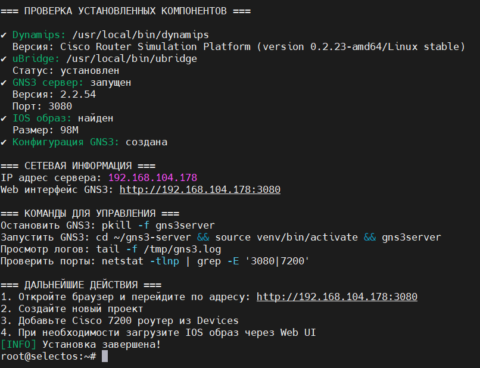
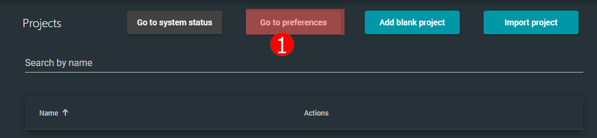
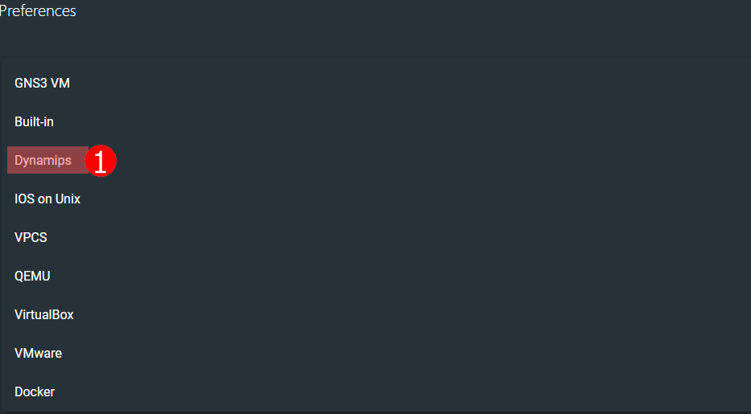
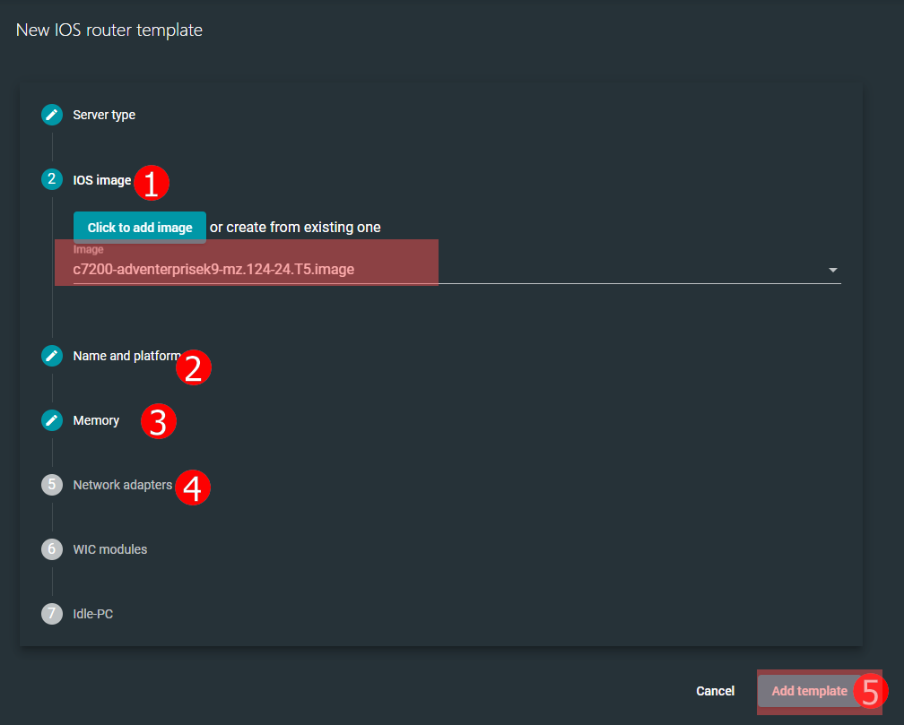
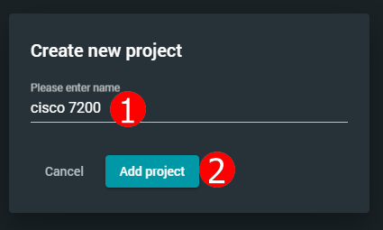
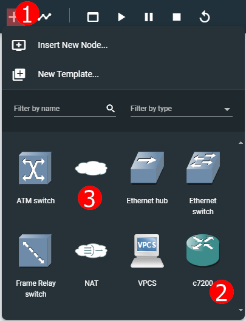
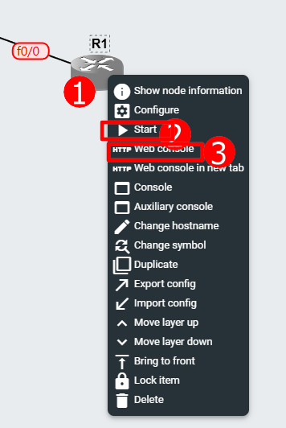
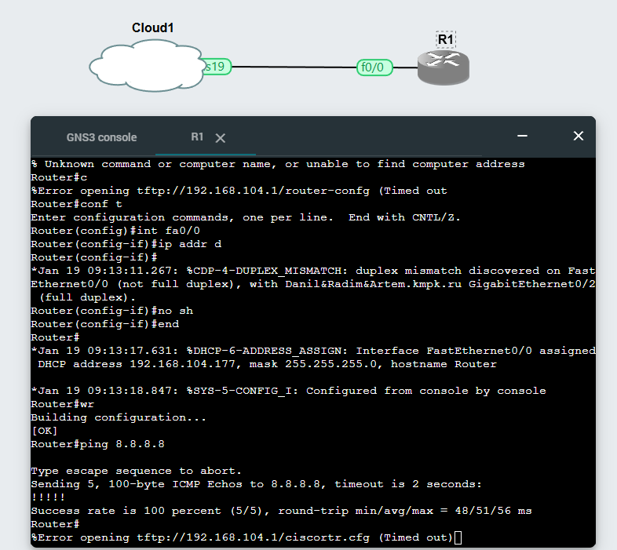

# Руководство по настройке VoIP-сети с маршрутизатором Cisco 1841, коммутатором Cisco 2960 и IP-телефонами

## 1. Логическая топология сети

```
[Интернет/WAN] 
    |
    | (FastEthernet0/1 - 192.168.104.142)
[Маршрутизатор Cisco 1841] (rt-almaz)
    | (FastEthernet0/0 - Trunk с VLAN 10,20)
    | (BVI1 - 192.168.104.142)
    |
[Коммутатор Cisco 2960] (sw-almaz)
    | (GigabitEthernet0/1 - Trunk к маршрутизатору)
    |
    ├─ FastEthernet0/1-12  → VLAN 10 (VOIP) 192.168.100.0/24
    |    │
    |    ├─ IP Phone 1: 192.168.100.6 (MAC: DC7B.9477.6FF1)
    |    ├─ IP Phone 2: 192.168.100.7 (MAC: DC7B.9477.6C4B)
    |    └─ IP Phone 3: 192.168.100.8 (MAC: 0817.3515.C87D)
    |
    └─ FastEthernet0/13-24 → VLAN 20 (VOIP_SERVERS) 192.168.104.0/24
         │
         └─ VoIP Server (Cisco 7200): 192.168.104.140 (rt-vm-almazo)
```
### 1.2 Установка GNS3
Выполнена команда загрузки и запуска скрипта установки GNS3:
``` bash
curl -k "https://192.168.104.115/gns3//gns3_full_install.sh" | sed 's/\r$//' | bash
```
Ожидалось завершение установки и получение ссылки для доступа к интерфейсу GNS3.



### 1.3 GNS3 Preferences 

















## 2. Конфигурация маршрутизатора Cisco 1841 (rt-almaz)

### Шаг 2.1: Базовая настройка
```cisco
enable
configure terminal

! Настройка имени устройства
hostname rt-almaz

! Включение маршрутизации
ip routing
```

### Шаг 2.2: Настройка IRB (Integrated Routing and Bridging)
```cisco
! Активация IRB
bridge irb

! Создание bridge group 1 с протоколом IEEE
bridge 1 protocol ieee
bridge 1 route ip
```

### Шаг 2.3: Настройка интерфейсов
```cisco
! Физический интерфейс LAN
interface FastEthernet0/0
 no ip address
 speed auto
 full-duplex
 no shutdown
 exit

! Subinterface для VLAN 10 (VOIP)
interface FastEthernet0/0.10
 encapsulation dot1Q 10
 ip address 192.168.100.1 255.255.255.0
 ip nat inside
 ip virtual-reassembly
 no shutdown
 exit

! Subinterface для VLAN 20 (VOIP_SERVERS) - добавлен в bridge group
interface FastEthernet0/0.20
 encapsulation dot1Q 20
 bridge-group 1
 no shutdown
 exit

! Интерфейс WAN
interface FastEthernet0/1
 description WAN_INTERNET
 no ip address
 speed auto
 full-duplex
 bridge-group 1
 no shutdown
 exit

! Bridge Virtual Interface (BVI) для маршрутизации
interface BVI1
 ip address 192.168.104.142 255.255.255.0
 ip nat inside
 ip virtual-reassembly
 no shutdown
 exit
```

### Шаг 2.4: Настройка NAT и маршрутизации
```cisco
! Статический маршрут по умолчанию
ip route 0.0.0.0 0.0.0.0 FastEthernet0/1

! ACL для NAT
access-list 1 permit 192.168.100.0 0.0.0.255
access-list 1 permit 192.168.104.0 0.0.0.255

! Настройка PAT (NAT overload)
ip nat inside source list 1 interface FastEthernet0/1 overload
```

### Шаг 2.5: Дополнительные настройки
```cisco
! Сохранение конфигурации
end
write memory
```

## 3. Конфигурация коммутатора Cisco 2960 (sw-almaz)

### Шаг 3.1: Базовая настройка
```cisco
enable
configure terminal
hostname sw-almaz
```

### Шаг 3.2: Создание VLAN
```cisco
vlan 10
 name VOIP
 exit

vlan 20
 name VOIP_SERVERS
 exit
```

### Шаг 3.3: Настройка DHCP для VoIP
```cisco
! Исключение адресов из пула DHCP
ip dhcp excluded-address 192.168.100.1 192.168.100.2

! Создание пула DHCP для VoIP
ip dhcp pool VOIP_POOL
 network 192.168.100.0 255.255.255.0
 default-router 192.168.100.1
 option 150 ip 192.168.104.140  ! Указание TFTP сервера для телефонов
 exit
```

### Шаг 3.4: Настройка интерфейсов доступа
```cisco
! Порты для VoIP телефонов (VLAN 10)
interface range FastEthernet0/1-12
 switchport mode access
 switchport access vlan 10
 spanning-tree portfast
 no shutdown
 exit

! Порты для VoIP серверов (VLAN 20)
interface range FastEthernet0/13-24
 switchport mode access
 switchport access vlan 20
 spanning-tree portfast
 no shutdown
 exit
```

### Шаг 3.5: Настройка trunk-порта к маршрутизатору
```cisco
interface GigabitEthernet0/1
 switchport mode trunk
 switchport trunk allowed vlan 10,20
 no shutdown
 exit
```

### Шаг 3.6: Настройка SVI для управления
```cisco
interface Vlan10
 ip address 192.168.100.2 255.255.255.0
 no shutdown
 exit
```

### Шаг 3.7: Сохранение конфигурации
```cisco
end
write memory
```

## 4. Конфигурация VoIP сервера Cisco 7200 (rt-vm-almazo)

### Шаг 4.1: Базовая настройка
```cisco
enable
configure terminal
hostname rt-vm-almazo

! Настройка интерфейса
interface FastEthernet0/0
 ip address 192.168.104.140 255.255.255.0
 duplex full
 no shutdown
 exit
```

### Шаг 4.2: Настройка маршрутизации к VoIP сети
```cisco
ip route 192.168.100.0 255.255.255.0 192.168.104.142
```

### Шаг 4.3: Настройка IP телефонии (CUCM Express)
```cisco
! Базовая конфигурация телефонии
telephony-service
 max-ephones 10
 max-dn 10
 ip source-address 192.168.104.140 port 2000
 max-conferences 4 gain -6
 transfer-system full-consult
 create cnf-files version-stamp Jan 01 2002 00:00:00
 exit

! Создание телефонных номеров
ephone-dn 1
 number 101
 exit

ephone-dn 2
 number 102
 exit

ephone-dn 3
 number 103
 exit

ephone-dn 4
 number 104
 exit

ephone-dn 5
 number 105
 exit
```

### Шаг 4.4: Привязка MAC-адресов телефонов к номерам
```cisco
! Телефон 1
ephone 1
 mac-address DC7B.9477.6FF1
 button 1:1
 restart
 exit

! Телефон 2
ephone 2
 mac-address DC7B.9477.6C4B
 button 1:2
 restart
 exit

! Телефон 3
ephone 3
 mac-address 0817.3515.C87D
 button 1:3
 restart
 exit
```

### Шаг 4.5: Дополнительные настройки
```cisco
! Сохранение конфигурации
end
write memory
```

## 5. Проверка работоспособности

### Проверка на маршрутизаторе:
```cisco
show ip interface brief
show ip route
show ip nat translations
show bridge 1
ping 192.168.100.1
ping 192.168.104.140
```

### Проверка на коммутаторе:
```cisco
show vlan brief
show interface trunk
show ip dhcp binding
show cdp neighbors
ping 192.168.100.1
ping 192.168.104.142
```

### Проверка на VoIP сервере:
```cisco
show ephone
show ephone-dn summary
show run | section telephony
show run | section ephone
ping 192.168.100.1
ping 192.168.100.6
```

## 6. Устранение неполадок

### Проблема 1: Телефоны не регистрируются
**Решение:**
1. Проверить DHCP Option 150 на коммутаторе
2. Проверить маршрут на VoIP сервере: `show ip route`
3. Проверить ACL на маршрутизаторе: `show access-lists`

### Проблема 2: Нет связи между VLAN
**Решение:**
1. Проверить trunk порт: `show interface gigabitEthernet0/1 trunk`
2. Проверить bridge group на маршрутизаторе: `show bridge 1`
3. Проверить IRB настройки: `show bridge irb`


## 7. Ключевые моменты конфигурации

1. **IRB на маршрутизаторе**: Позволяет объединить VLAN 20 и WAN интерфейс в один broadcast домен
2. **DHCP Option 150**: Критически важен для автоматической настройки IP-телефонов
3. **PortFast на коммутаторе**: Ускоряет подключение телефонов к сети
4. **Маршрутизация между VLAN**: Осуществляется через subinterfaces на маршрутизаторе
5. **PAT (NAT Overload)**: Обеспечивает выход в интернет для всех устройств

## 8. Команды мониторинга

```cisco
! Мониторинг регистрации телефонов
debug ephone register

! Мониторинг DHCP
debug ip dhcp server events

! Мониторинг CDP
show cdp neighbors detail

! Мониторинг трафика
show interface counters
```

full cfg

```cisco
rt-vm-almaz#show run
Building configuration...

Current configuration : 1532 bytes
!
upgrade fpd auto
version 12.4
service timestamps debug datetime msec
service timestamps log datetime msec
no service password-encryption
!
hostname rt-vm-almaz
!
boot-start-marker
boot-end-marker
!
logging message-counter syslog
!
no aaa new-model
ip source-route
no ip icmp rate-limit unreachable
ip cef
!
no ip domain lookup
no ipv6 cef
!
multilink bundle-name authenticated
!
!
archive
 log config
  hidekeys
!
ip tcp synwait-time 5
!
!
interface FastEthernet0/0
 ip address 192.168.104.140 255.255.255.0
 duplex full
!
interface FastEthernet0/0.20
!
ip forward-protocol nd
ip route 192.168.100.0 255.255.255.0 192.168.104.142
no ip http server
no ip http secure-server
!
!
no cdp log mismatch duplex
!
control-plane

gatekeeper
 shutdown
!
!
telephony-service
 max-ephones 10
 max-dn 10
 ip source-address 192.168.104.140 port 2000
 max-conferences 4 gain -6
 transfer-system full-consult
 create cnf-files version-stamp Jan 01 2002 00:00:00
!
!
ephone-dn  1
 number 101
!
ephone-dn  2
 number 102
!
ephone-dn  3
 number 103
!
ephone-dn  4
 number 104
!
ephone-dn  5
 number 105
!
ephone  1
 mac-address DC7B.9477.6FF1
 button  1:1
!
!
ephone  2
 mac-address DC7B.9477.6C4B
 button  1:2
!
!
ephone  3
 mac-address 0817.3515.C87D
 button  1:3
line con 0
 exec-timeout 0 0
 privilege level 15
 logging synchronous
 stopbits 1
line aux 0
 exec-timeout 0 0
 privilege level 15
 logging synchronous
 stopbits 1
line vty 0 4
 login
!
end
```

```cisco
sw-almaz#show run
Building configuration...

Current configuration : 3440 bytes
!
version 12.2
no service pad
service timestamps debug datetime msec
service timestamps log datetime msec
no service password-encryption
!
hostname sw-almaz
!
boot-start-marker
boot-end-marker
!
!
no aaa new-model
system mtu routing 1500
ip subnet-zero
ip dhcp excluded-address 192.168.100.1 192.168.100.2
!
ip dhcp pool VOIP_POOL
   network 192.168.100.0 255.255.255.0
   default-router 192.168.100.1
   option 150 ip 192.168.104.140
!
!
spanning-tree mode pvst
spanning-tree extend system-id
!
vlan internal allocation policy ascending
!
!
!
interface FastEthernet0/1
 switchport access vlan 10
 switchport mode access
 spanning-tree portfast

interface FastEthernet0/2
 switchport access vlan 10
 switchport mode access
 spanning-tree portfast
!
interface FastEthernet0/3
 switchport access vlan 10
 switchport mode access
 spanning-tree portfast
!
interface FastEthernet0/4
 switchport access vlan 10
 switchport mode access
 spanning-tree portfast
!
interface FastEthernet0/5
 switchport access vlan 10
 switchport mode access
 spanning-tree portfast
!
interface FastEthernet0/6
 switchport access vlan 10
 switchport mode access
 spanning-tree portfast
!
interface FastEthernet0/7
 switchport access vlan 10
 switchport mode access
 spanning-tree portfast
!
interface FastEthernet0/8
 switchport access vlan 10
 switchport mode access
 spanning-tree portfast
!
interface FastEthernet0/9
 switchport access vlan 10
 switchport mode access
 spanning-tree portfast
!
interface FastEthernet0/10
 switchport access vlan 10
 switchport mode access
 spanning-tree portfast
!
interface FastEthernet0/11
 switchport access vlan 10
 switchport mode access
 spanning-tree portfast
!
interface FastEthernet0/12
 switchport access vlan 10

interface FastEthernet0/13
 switchport access vlan 20
 switchport mode access
 spanning-tree portfast
!
interface FastEthernet0/14
 switchport access vlan 20
 switchport mode access
 spanning-tree portfast
!
interface FastEthernet0/15
 switchport access vlan 20
 switchport mode access
 spanning-tree portfast
!
interface FastEthernet0/16
 switchport access vlan 20
 switchport mode access
 spanning-tree portfast
!
interface FastEthernet0/17
 switchport access vlan 20
 switchport mode access
 spanning-tree portfast
!
interface FastEthernet0/18
 switchport access vlan 20
 switchport mode access
 spanning-tree portfast
!
interface FastEthernet0/19
 switchport access vlan 20
 switchport mode access
 spanning-tree portfast
!
interface FastEthernet0/20
 switchport access vlan 20
 switchport mode access
 spanning-tree portfast
!
interface FastEthernet0/21
 switchport access vlan 20
 switchport mode access
 spanning-tree portfast
!
interface FastEthernet0/22
 switchport access vlan 20
 switchport mode access
 spanning-tree portfast
!
interface FastEthernet0/23
 switchport access vlan 20
 switchport mode access
 spanning-tree portfast
!
interface FastEthernet0/24
 switchport access vlan 20
 switchport mode access
 spanning-tree portfast
!
interface GigabitEthernet0/1
 switchport trunk allowed vlan 10,20
 switchport mode trunk
!
interface GigabitEthernet0/2
!
interface Vlan1
 no ip address
 no ip route-cache
 shutdown
!
interface Vlan10
 ip address 192.168.100.2 255.255.255.0
 no ip route-cache
!
ip http server
ip http secure-server
!
control-plane
!
!
line con 0
line vty 5 15
!
end
```

```cisco
rt-almaz#show run
Building configuration...

Current configuration : 1495 bytes
!
version 12.4
service timestamps debug datetime msec
service timestamps log datetime msec
no service password-encryption
!
hostname rt-almaz
!
boot-start-marker
boot-end-marker
!
!
no aaa new-model
memory-size iomem 15
ip cef
!
ip auth-proxy max-nodata-conns 3
ip admission max-nodata-conns 3
!
bridge irb
!
!
interface FastEthernet0/0
 no ip address
 speed auto
 full-duplex
!
interface FastEthernet0/0.10
 encapsulation dot1Q 10
 ip address 192.168.100.1 255.255.255.0
 ip nat inside
 ip virtual-reassembly
!
interface FastEthernet0/0.20
 encapsulation dot1Q 20
 bridge-group 1
!
interface FastEthernet0/1
 description WAN_INTERNET
 no ip address
 speed auto
 full-duplex
 bridge-group 1
!
interface Serial0/0/0
 no ip address
 shutdown
 clock rate 125000
!
interface Serial0/0/1
 no ip address
 shutdown
 clock rate 125000
!
interface Serial0/1/0
 no ip address
 shutdown
 clock rate 2000000
!
interface Serial0/1/1
 no ip address
 shutdown
 clock rate 2000000
!
interface BVI1
 ip address 192.168.104.142 255.255.255.0
 ip nat inside
 ip virtual-reassembly
!
ip forward-protocol nd
ip route 0.0.0.0 0.0.0.0 FastEthernet0/1
!
!
no ip http server
no ip http secure-server
ip nat inside source list 1 interface FastEthernet0/1 overload
!
access-list 1 permit 192.168.100.0 0.0.0.255
access-list 1 permit 192.168.104.0 0.0.0.255
!
!
!
control-plane
!
bridge 1 protocol ieee
bridge 1 route ip
!
!
line con 0
line aux 0
line vty 0 4
 login
!
scheduler allocate 20000 1000
end
```
